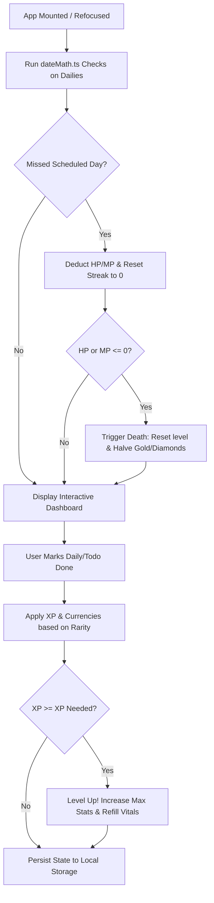

Markdown

# QuestHabit

**Name:** Walaa Abdulghani Qasem Alyhari

**Github Link:** <https://github.com/walaaalyhari/questhabit>

**Live Demo:** <https://quest-habit.netlify.app>

## SUMMARY

QuestHabit is an immersive, client-side gamified habit tracker designed to convert daily routines into an engaging RPG progression system. Traditional habit trackers often suffer from user fatigue due to a lack of intrinsic rewards. QuestHabit solves this by translating real-life actions into digital character stats (XP, HP, MP) and gold/diamond currencies, encouraging consistent personal development through interactive feedback loops.

## TECHNOLOGY STACK

The application utilizes a lightweight, high-performance, and entirely client-side stack optimized for zero-latency interactions and reliable offline-first persistence.

- **Frontend Framework:** React with TypeScript for clean component architecture and strict compile-time type-safety over complex player stats.
- **Build Tool:** Vite for instantaneous Hot Module Replacement (HMR) and highly optimized production builds.
- **Styling & UI:** Tailwind CSS for a modern, responsive glassmorphic design and dark/light theme tokens without stylesheet overhead.
- **Animations:** Framer Motion for tactile micro-interactions and smooth UI animations that provide game-like feedback.
- **Iconography:** Lucide React for consistent, modern SVG game and navigation icons.
- **Persistence:** HTML5 Local Storage for zero-overhead, instant data saving and loading directly within the user's browser.
- **Development & Debugging Tool:** AntiGravity IDE, utilized as an AI-powered helper agent to simulate and isolate execution states, validate complex date transitions in _"dateMath.ts"_, and perform rapid trial-and-error debugging on player progression mechanics.

## KEY FEATURES

### A. RPG Progression & Economy Engine (useHabits.ts)

The application core models real-life productivity as game progression:

- **Stat Tracker:** Completing tasks yields Experience (XP) to level up and restores Health (HP) or Mana (MP).
- **XP Scaling Formula:** The experience points required to level up grow dynamically:

_XP Needed = Current Level \* 100 \* 1.2_

- **Rarity Matrix:** Tasks can be prioritized by rarity (Common, Uncommon, Rare, Legendary), scaling the XP, Coins, and Diamonds rewarded.

### B. High-Stakes Penalty & "Death" System

To replace "unbroken streak anxiety" with engaging accountability:

- **Active Penalties:** Neglecting scheduled daily quests results in a loss of HP or MP.
- **The Death Mechanic:** If HP or MP reaches 0, the player's character "dies." This resets their level to 1, restores their vital, and halves their current balance of Coins and Diamonds, establishing meaningful stakes for daily habits.

### C. Calendar-Day Streak Logic (dateMath.ts)

Standard timestamp differences fail when a user checks in late at night and early the next morning. QuestHabit implements a calendar-day boundary check:

- **Midnight Normalization:** Strips active hours to local midnight boundaries:

```typescript
_Midnight(Date) = new Date(Date.getFullYear(), Date.getMonth(), Date.getDate(), 0, 0, 0, 0)_
```

- **State Detection:** Accurately distinguishes between a completed day (d = 0), consecutive days (d = 1 to increment streaks), and a missed streak period (d > 1).

### D. Lazy-Evaluation Missed Day Detection

Because the app runs entirely in-browser without a server cron job, it dynamically evaluates missed days:

- On application initialization or tab focus, it compares current time against each habit's lastCompletedDate using dateMath.ts.
- If a calendar day was missed, it calculates elapsed missed days, applies HP/MP damage, resets the active streak to 0, and saves the updated profile state in one single pass.

### E. Rewards Shop & Customization

- **In-Game Shop:** Users spend accumulated Coins and Diamonds on customizable real-life rewards (e.g., "Game Time!" "Spa Day").
- **Onboarding:** A clean initial configuration screen introduces players to character setup and basic tracking mechanics.

## PROJECT DIRECTORY STRUCTURE

Below is the verified project tree structure representing the codebase organization. This layout highlights the clean separation between custom React hooks, presentational components, and localized utility math.  

```
src/
├── components/
│   ├── AddHabitModal.tsx
│   ├── ArchivedModal.tsx
│   ├── BottomNav.tsx
│   ├── DashboardHeader.tsx
│   ├── HabitCard.tsx
│   ├── RewardsView.tsx
│   ├── SettingsModal.tsx
│   └── WelcomeScreen.tsx
├── hooks/
│   └── useHabits.ts
├── SVG/
├── utils/
│   ├── dateMath.ts
│   └── storage.ts
├── App.tsx
├── index.css
├── main.tsx
├── types.ts
└── vite-env.d.ts
.gitignore
GUIDE.md
index.html
LICENSE.md
metadata.json
package-lock.json
package.json
README.md
tsconfig.json
vite.config.ts
```

## CORE DATA MODELS (_src/types.ts_)

**1\. Player Statistics (UserStats)**

``` TypeScript
export interface UserStats {

level: number;

xp: number;

xpNeeded: number;

hp: number;

maxHp: number;

mp: number;

maxMp: number;

coins: number;

diamonds: number;

deaths: number;

}
```

**2\. Habit Metadata (Habit)**

``` TypeScript
export type Rarity = 'Common' | 'Uncommon' | 'Rare' | 'Legendary';

export interface Habit {

id: string;

name: string;

type: 'daily' | 'habit' | 'todo';

rarity: Rarity;

streak: number;

lastCompletedDate: string | null; // ISO string format

isArchived: boolean;

createdAt: string;

}
```

## SYSTEM WORKFLOWS

Below are the operational pathways representing the core game cycle.


